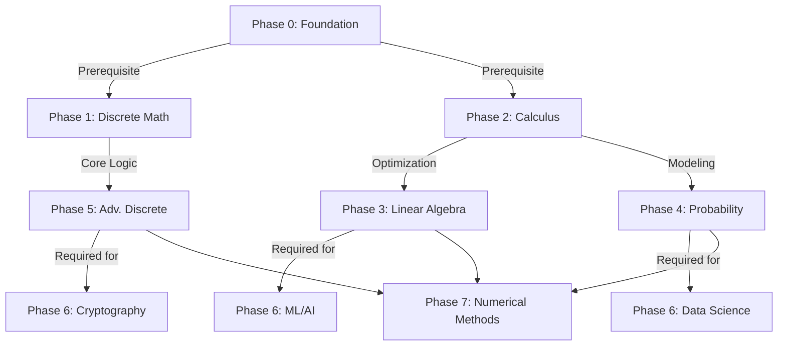
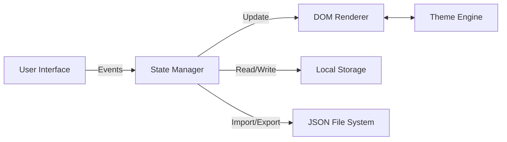

# Mathematics Roadmap for Computer Science

> An interactive, single-file web application designed to visualize, track, and master the mathematics required for a career in Computer Science.

[🚀 Live Web App](https://aliriyaj007.github.io/Complete-mathematics-roadmap-for-computer-science-students/) &nbsp;|&nbsp; [⬇️ Direct Download](https://github.com/Aliriyaj007/Complete-mathematics-roadmap-for-computer-science-students/archive/refs/heads/main.zip)

---

## 📌 Why This Tool Exists

Mathematics is often taught as abstract theory, leaving many Computer Science students struggling to connect concepts like Linear Algebra or Probability to actual engineering problems.

This tool bridges the gap. It transforms a massive, intimidating curriculum into a **modular, visual checklist** that ties every mathematical concept directly to its practical application in CS (e.g., Cryptography, Graphics, Machine Learning). It exists to remove the ambiguity of "what do I learn next?" and "why do I need to know this?"

---

## ⚡ The Value Shift

Before and After using this roadmap:

| Aspect | Before (Traditional Approach) | After (Using This Tool) |
| :--- | :--- | :--- |
| **Structure** | Scattered PDFs and random blog posts. | A unified, chronological grid from Arithmetic to Specializations. |
| **Motivation** | "I have to learn Calculus." | "I need Calculus to build a Physics Engine." |
| **Tracking** | Forgetting what you studied 2 weeks ago. | Persistent visual progress bars and JSON backups. |
| **Context** | Abstract theorems with no code. | Direct links to CS applications (e.g., "RSA Encryption requires Number Theory"). |

---

## 🚀 Quick Start (Under 60 Seconds)

1.  **Open:** Access the tool [here](https://aliriyaj007.github.io/Complete-mathematics-roadmap-for-computer-science-students/).
2.  **Select:** Choose a theme (Light, Dark, or Cyber) in the header.
3.  **Track:** Click on any topic checkbox to mark it as complete. The progress bar updates instantly.
4.  **Backup:** Click `Backup` to download your progress as a JSON file. Keep it safe; you can `Restore` it anytime on any device.

That's it. No account creation, no database dependencies, no friction.

---

## 🧭 Visual Overview

### The Learning Flow
This roadmap is designed to guide you from foundational basics to specialized fields, ensuring you don't skip critical dependencies.



### Application Architecture
Built for maximum portability and performance using vanilla web technologies.



---

## 🛠️ Installation & Usage

This project is a single HTML file containing all CSS and JS. It requires no build process, no server, and no installation.

### Method 1: Hosted (Instant)
Simply visit the GitHub Pages link. Zero setup required.

### Method 2: Local Use (Offline)
1.  Clone the repository:
    ```bash
    git clone https://github.com/Aliriyaj007/Complete-mathematics-roadmap-for-computer-science-students.git
    ```
2.  Open `index.html` in any modern browser.

### Method 3: Embed
You can embed the logic into any static site generator (Hugo, Jekyll) by pasting the code block into a template.

---

## ✨ Key Features

| Feature | Description | Benefit |
| :--- | :--- | :--- |
| **7-Phase Structure** | Covers Foundation to Specialization (ML, Graphics, Crypto). | Complete career lifecycle coverage. |
| **Interactive Grid** | Responsive CSS Grid layout that adapts to mobile/desktop. | Usable on any device without zooming. |
| **State Persistence** | Uses `localStorage` and JSON import/export. | You never lose your progress, even if you clear cache. |
| **Theming Engine** | Switch between Light, Dark, and Cyber modes dynamically. | Reduces eye strain during long study sessions. |
| **Contextual Links** | Every topic maps to a CS concept (e.g., Eigenvectors → Graphics). | Immediate understanding of "Why am I learning this?". |

---

## 🤝 Contribution

This is an open-source utility. While it is currently feature-complete for its core purpose, contributions are welcome in the following areas:

*   **Curriculum Refinement:** If a specific mathematical topic is missing or outdated.
*   **Translations:** Localizing the interface for non-English speakers.
*   **Accessibility:** Improving screen reader support and keyboard navigation.

To contribute:
1.  Fork the project.
2.  Create a feature branch (`git checkout -b feature/amazing-feature`).
3.  Commit your changes (`git commit -m 'Add amazing feature'`).
4.  Push to the branch (`git push origin feature/amazing-feature`).
5.  Open a Pull Request.

---

## 📝 Author & Contact

**Riyajul Ali**

*   **GitHub:** [Aliriyaj007](https://github.com/Aliriyaj007)
*   **LinkedIn:** [linkedin.com/in/Aliriyaj007](https://linkedin.com/in/Aliriyaj007)
*   **Email:** [aliriyaj007@protonmail.com](mailto:aliriyaj007@protonmail.com)

---

## 📄 License

No License

---

*"Mathematics is the language in which God has written the universe." — Galileo. This tool is merely the dictionary."*
