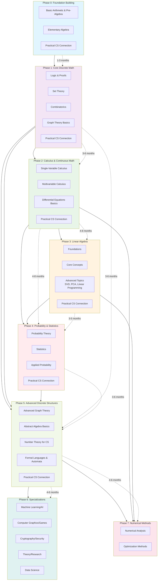
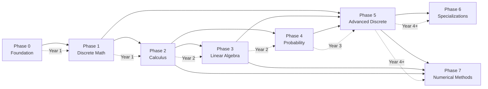

---

Here's the mathematics roadmap for computer science students presented as a Mermaid flowchart:

```mermaid
flowchart TD
    subgraph P0[Phase 0: Foundation Building]
        P0_A[Basic Arithmetic & Pre-Algebra]
        P0_B[Elementary Algebra]
        P0_C[Practical CS Connection]
    end
    
    P0 --> P1
    
    subgraph P1[Phase 1: Core Discrete Math]
        P1_A[Logic & Proofs]
        P1_B[Set Theory]
        P1_C[Combinatorics]
        P1_D[Graph Theory Basics]
        P1_E[Practical CS Connection]
    end
    
    P1 --> P2
    P1 --> P5
    
    subgraph P2[Phase 2: Calculus & Continuous Math]
        P2_A[Single-Variable Calculus]
        P2_B[Multivariable Calculus]
        P2_C[Differential Equations Basics]
        P2_D[Practical CS Connection]
    end
    
    P2 --> P3
    
    subgraph P3[Phase 3: Linear Algebra]
        P3_A[Foundations]
        P3_B[Core Concepts]
        P3_C[Advanced Topics<br>SVD, PCA, Linear Programming]
        P3_D[Practical CS Connection]
    end
    
    P2 --> P4
    P3 --> P4
    
    subgraph P4[Phase 4: Probability & Statistics]
        P4_A[Probability Theory]
        P4_B[Statistics]
        P4_C[Applied Probability]
        P4_D[Practical CS Connection]
    end
    
    P1 --> P5
    P4 --> P5
    
    subgraph P5[Phase 5: Advanced Discrete Structures]
        P5_A[Advanced Graph Theory]
        P5_B[Abstract Algebra Basics]
        P5_C[Number Theory for CS]
        P5_D[Formal Languages & Automata]
        P5_E[Practical CS Connection]
    end
    
    P5 --> P6
    
    subgraph P6[Phase 6: Specializations]
        P6_ML[Machine Learning/AI]
        P6_CG[Computer Graphics/Games]
        P6_CRYPT[Cryptography/Security]
        P6_THEORY[Theory/Research]
        P6_DS[Data Science]
    end
    
    P5 --> P7
    P2 --> P7
    P3 --> P7
    
    subgraph P7[Phase 7: Numerical Methods]
        P7_A[Numerical Analysis]
        P7_B[Optimization Methods]
    end
    
    %% Styling for clarity
    classDef phase0 fill:#e1f5fe
    classDef phase1 fill:#f3e5f5
    classDef phase2 fill:#e8f5e8
    classDef phase3 fill:#fff3e0
    classDef phase4 fill:#ffebee
    classDef phase5 fill:#f1f8e9
    classDef phase6 fill:#e0f2f1
    classDef phase7 fill:#fce4ec
    
    class P0 phase0
    class P1 phase1
    class P2 phase2
    class P3 phase3
    class P4 phase4
    class P5 phase5
    class P6 phase6
    class P7 phase7
    
    %% Learning pathway notes
    P0 -.->|1-3 months| P1
    P1 -.->|3-6 months| P2
    P1 -.->|3-6 months| P5
    P2 -.->|4-8 months| P3
    P2 -.->|4-8 months| P4
    P3 -.->|3-5 months| P4
    P4 -.->|3-6 months| P5
    P5 -.->|4-6 months| P6
    P5 -.->|4-6 months| P7
```

**Alternative Linear Progression View:**

```mermaid
flowchart LR
    P0[Phase 0<br>Foundation] --> P1[Phase 1<br>Discrete Math] --> P2[Phase 2<br>Calculus]
    
    P2 --> P3[Phase 3<br>Linear Algebra]
    P2 --> P4[Phase 4<br>Probability]
    
    P1 --> P5[Phase 5<br>Advanced Discrete]
    P3 --> P5
    P4 --> P5
    
    P5 --> P6[Phase 6<br>Specializations]
    P5 --> P7[Phase 7<br>Numerical Methods]
    
    P3 --> P7
    P2 --> P7
    
    %% Timeline indicators
    P0 -.->|Year 1| P1
    P1 -.->|Year 1| P2
    P2 -.->|Year 2| P3
    P3 -.->|Year 2| P4
    P4 -.->|Year 3| P5
    P5 -.->|Year 4+| P6
    P5 -.->|Year 4+| P7
```
