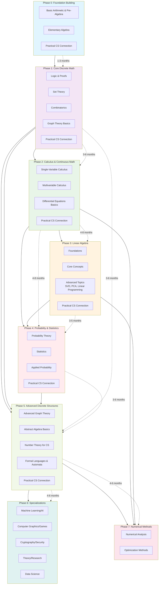
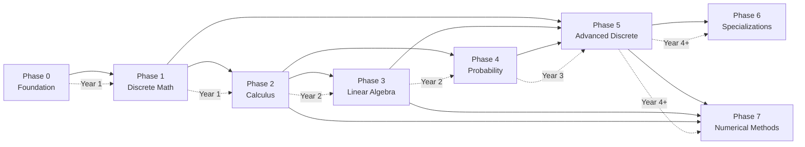

# Comprehensive Mathematics Roadmap for Computer Science Students

## **Phase 0: Foundation Building (Pre-University/Review)**
*Duration: 1-3 months*

### **Basic Arithmetic & Pre-Algebra**
- Number systems (integers, fractions, decimals)
- Order of operations (PEMDAS/BODMAS)
- Factors, multiples, primes
- Ratios, proportions, percentages
- Basic equations and inequalities

### **Elementary Algebra**
- Linear equations and graphing
- Polynomials (addition, multiplication, factoring)
- Quadratic equations
- Systems of equations
- Functions and their properties

### **Practical CS Connection**
- Understanding data representation
- Basic algorithm counting steps
- Simple complexity reasoning

## **Phase 1: Core Discrete Mathematics**
*Duration: 3-6 months*

### **Logic & Proofs**
- Propositional and predicate logic
- Truth tables, logical equivalences
- Proof techniques: direct, contradiction, induction
- Quantifiers and negations

### **Set Theory**
- Sets, subsets, power sets
- Set operations (union, intersection, complement)
- Relations and equivalence relations
- Functions: injective, surjective, bijective
- Cardinality and countability

### **Combinatorics**
- Counting principles: addition, multiplication
- Permutations and combinations
- Binomial theorem and coefficients
- Pigeonhole principle
- Inclusion-exclusion principle

### **Graph Theory Basics**
- Graphs, vertices, edges, degree
- Paths, cycles, connectivity
- Trees and spanning trees
- Graph representations (adjacency matrix/list)

### **Practical CS Connection**
- Database query logic
- Algorithm correctness proofs
- Data structure design (trees, graphs)
- Network modeling

## **Phase 2: Calculus & Continuous Mathematics**
*Duration: 4-8 months*

### **Single-Variable Calculus**
- Limits and continuity
- Derivatives: rules, applications, optimization
- Integrals: definite/indefinite, techniques
- Fundamental Theorem of Calculus
- Series and sequences (convergence tests)

### **Multivariable Calculus**
- Partial derivatives and gradients
- Multiple integrals
- Vector calculus basics
- Optimization with constraints

### **Differential Equations Basics**
- First-order linear equations
- Applications to modeling

### **Practical CS Connection**
- Machine learning optimization (gradient descent)
- Computer graphics (curves, surfaces)
- Physics simulations
- Algorithm analysis (summations, integrals)

## **Phase 3: Linear Algebra**
*Duration: 3-5 months*

### **Foundations**
- Vectors and vector spaces
- Linear transformations
- Matrices and matrix operations
- Systems of linear equations (Gaussian elimination)

### **Core Concepts**
- Determinants and properties
- Eigenvalues and eigenvectors
- Diagonalization
- Orthogonality and projections
- Vector norms and inner products

### **Advanced Topics**
- Singular Value Decomposition (SVD)
- Principal Component Analysis (PCA)
- Linear programming basics

### **Practical CS Connection**
- Computer graphics (transformations)
- Machine learning (dimensionality reduction)
- Network analysis (adjacency matrices)
- Cryptography (linear cryptanalysis)

## **Phase 4: Probability & Statistics**
*Duration: 3-6 months*

### **Probability Theory**
- Axioms of probability
- Conditional probability and Bayes' theorem
- Random variables: discrete and continuous
- Expectation, variance, moments
- Common distributions (Bernoulli, Binomial, Gaussian, Exponential)

### **Statistics**
- Descriptive statistics
- Statistical inference
- Hypothesis testing
- Confidence intervals
- Regression analysis

### **Applied Probability**
- Markov chains
- Random processes basics
- Information theory (entropy, KL divergence)

### **Practical CS Connection**
- Machine learning (Bayesian methods)
- Randomized algorithms
- Data science and analytics
- Network reliability modeling
- Cryptography (random number generation)

## **Phase 5: Advanced Discrete Structures**
*Duration: 4-6 months*

### **Advanced Graph Theory**
- Graph algorithms (shortest path, max flow)
- Planarity and coloring
- Matching theory
- Network flows

### **Abstract Algebra Basics**
- Groups, rings, fields
- Modular arithmetic
- Finite fields (Galois fields)

### **Number Theory for CS**
- Modular arithmetic
- Prime numbers and factorization
- Chinese Remainder Theorem
- Euler's theorem and Fermat's little theorem

### **Formal Languages & Automata**
- Regular languages and finite automata
- Context-free grammars and pushdown automata
- Turing machines
- Computability and complexity basics

### **Practical CS Connection**
- Algorithm design (greedy, dynamic programming)
- Cryptography (RSA, elliptic curves)
- Compiler design (parsing)
- Database theory (relational algebra)

## **Phase 6: Advanced Mathematics for Specializations**
*Duration: Ongoing (choose based on interests)*

### **For Machine Learning/AI**
- Multivariate calculus (matrix calculus)
- Information geometry
- Optimization theory
- Statistical learning theory
- Stochastic processes

### **For Computer Graphics/Games**
- Computational geometry
- Differential geometry basics
- Quaternions and rotations
- Fourier analysis
- Numerical methods

### **For Cryptography/Security**
- Advanced number theory
- Elliptic curve cryptography
- Lattice-based cryptography
- Complexity theory (P vs NP)
- Information theory

### **For Theory/Research**
- Real analysis
- Measure theory basics
- Category theory introduction
- Advanced combinatorics (generating functions)
- Topology basics

### **For Data Science**
- Bayesian statistics
- Time series analysis
- Multivariate statistics
- Experimental design
- Non-parametric methods

## **Phase 7: Numerical Methods & Computational Mathematics**
*Duration: 3-4 months*

### **Numerical Analysis**
- Floating point arithmetic
- Numerical linear algebra
- Root finding algorithms
- Numerical integration and differentiation
- Interpolation and approximation

### **Optimization**
- Linear programming (simplex method)
- Convex optimization basics
- Gradient methods
- Constrained optimization

## **Learning Strategy & Resources**

### **Progressive Project Integration**
1. **Beginner**: Implement basic algorithms (factorial, Fibonacci with proofs)
2. **Intermediate**: Build a simple neural network (calculus + linear algebra)
3. **Advanced**: Implement RSA encryption (number theory)
4. **Expert**: Create a simple ray tracer (linear algebra + calculus)

### **Recommended Resources**
- **Books**: "Concrete Mathematics" by Knuth, "Linear Algebra Done Right"
- **Online**: MIT OCW, 3Blue1Brown (YouTube), Khan Academy
- **Interactive**: Project Euler, LeetCode math problems
- **Software**: Python with NumPy/SciPy, MATLAB, Wolfram Mathematica

### **Assessment Milestones**
1. Can prove algorithm correctness using induction
2. Can derive backpropagation from calculus principles
3. Can implement SVD from scratch
4. Can analyze randomized algorithm success probability
5. Can design a cryptosystem using number theory

## **Timeline Suggestions**
- **Year 1**: Phases 0-2 (Foundation + Discrete Math + Calculus)
- **Year 2**: Phases 3-4 (Linear Algebra + Probability)
- **Year 3**: Phase 5 (Advanced Discrete)
- **Year 4+**: Phase 6 (Specializations)

## **Key Mindset Principles**
1. **Mathematics is a language** for expressing computational ideas
2. **Focus on intuition** before formalism
3. **Implement to internalize** - always code the concepts
4. **Connect every concept** to a CS application
5. **Embrace abstraction** - it's the essence of computer science

This roadmap is modular - focus on areas most relevant to your interests while maintaining core competency across all foundational areas. Regular practice and application to programming problems are essential for true mastery.

---

Here's the mathematics roadmap for computer science students presented as a Mermaid flowchart:

**Alternative Linear Progression View:**

